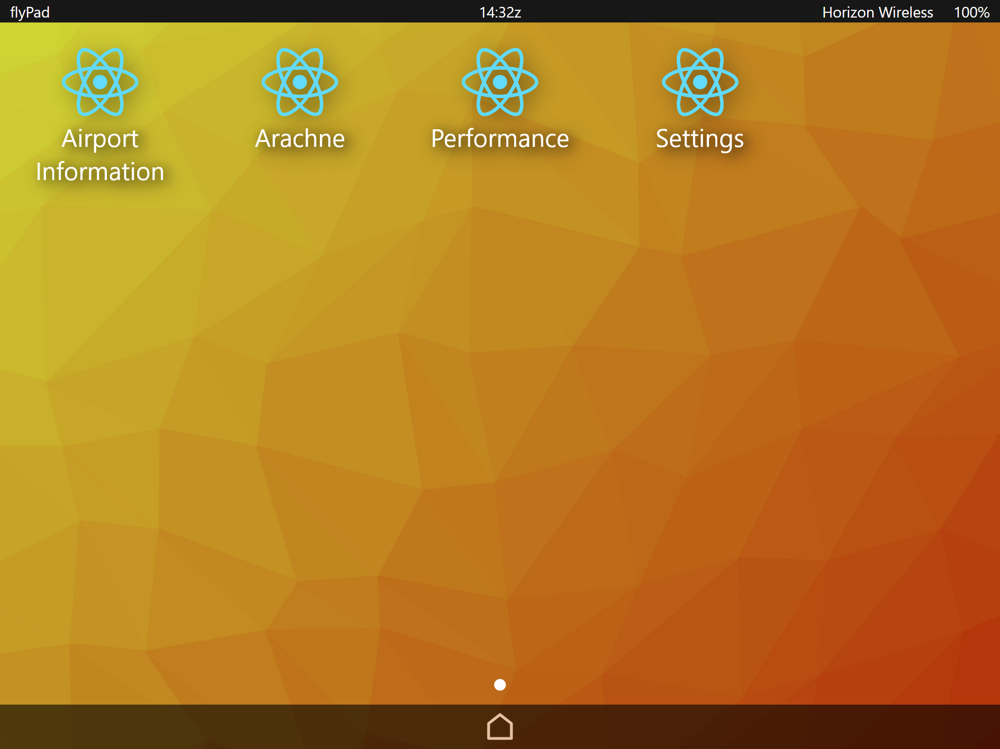
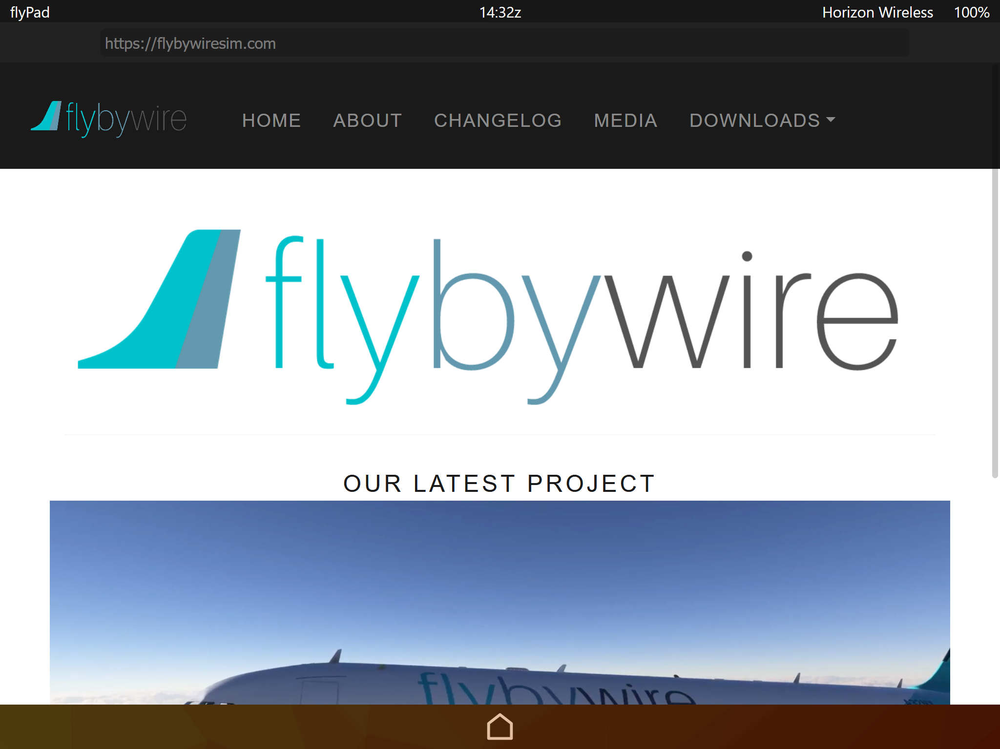
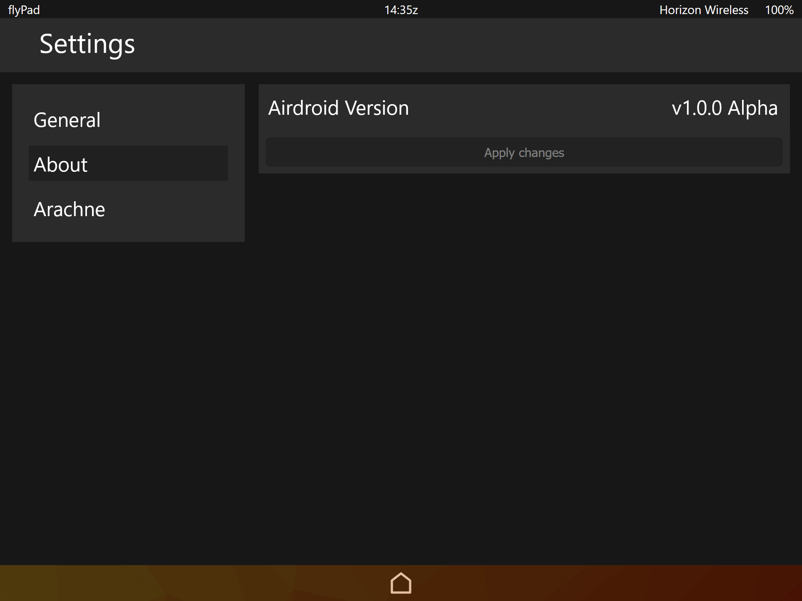
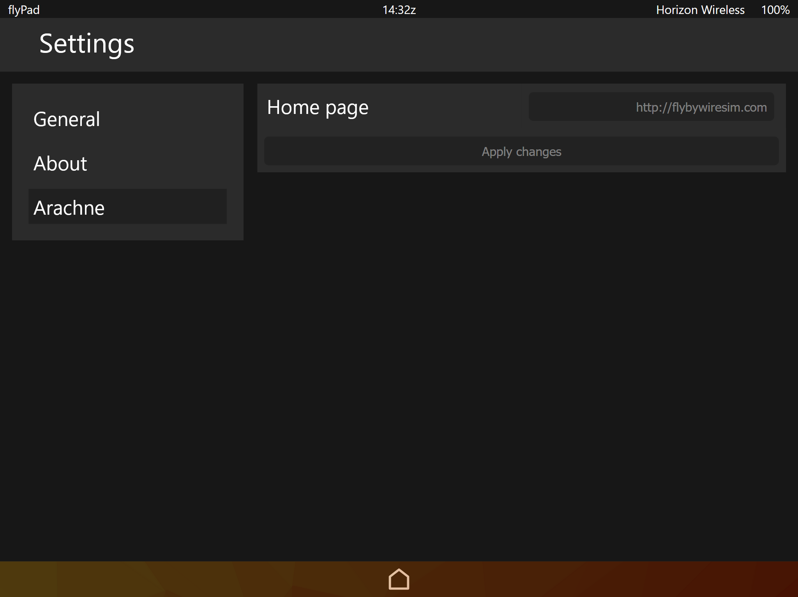

# A32NX Electronic Flight Bag

This is an attempt to create a platform for other developers to create 'modules' for the Fly By Wire A32NX Electronic Flight Bag. A lot of work still has to be done. Logo's are still basically non-existent, fonts could be refined and a lot of functionality has to be ported.

## Screenshots
{.screenshot1}
{.screenshot2}
{.screenshot3}
{.screenshot4}

